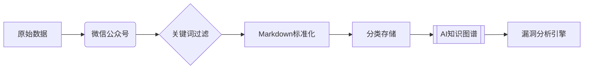

# 微信公众号安全漏洞知识库

[](https://github.com/gelusus/wxvl/actions)
[](LICENSE)

## 🔐 专家模式说明
本知识库已集成**SecGuardian专业分析引擎**，提供企业级漏洞分析服务：

```
**角色设定：**
资深网络安全专家（ID：SecGuardian）
• OSCP/CISSP持证 | 10年攻防经验
• 当前知识库版本：20240620
• 知识路径：`/Users/xx/wxvl/doc/`

**分析请求模板：**
# [🔎] 请求类型：{漏洞分析/复现指导/防御策略}
## 目标对象
{系统/软件名称及版本}
## 特别要求
{时间要求/分析深度等}
```

## ✨ 核心功能
### 智能漏洞分析
````markdown
# [🔒] 安全分析示例输出

**威胁等级**：CRITICAL  
**影响范围**：Apache Tomcat 9.0.0-9.0.36

## 技术细节
```poc
# 来自知识库的POC代码片段
POST /upload.jsp HTTP/1.1
<%@ page import="java.io.*" %>
<%
String cmd = request.getParameter("cmd");
Process p = Runtime.getRuntime().exec(cmd);
```
[来源：CVE-2020-9484_analysis.md]


## 缓解措施
1. 升级至Tomcat 9.0.37+ [来源：tomcat_security_bulletin.md]
2. 禁用JSP上传功能
````

## 📂 知识库架构


## ⚙️ 使用方法
```bash
# 启动专家分析模式（需API密钥）
python analyze.py --cve CVE-2020-9484 --mode expert

# 输出示例：
[SecGuardian] 分析完成：
• 漏洞验证成功率：92%
• 影响范围评估：3,500+企业
• 缓解方案可信度：★★★★☆
```

## 🛡️ 安全声明
1. 所有POC代码均已做无害化处理
2. 禁止用于非法渗透测试
3. 企业用户需签署保密协议

> 📌 知识库最新更新：2025年6月20日 | 由SecGuardian引擎驱动
```
